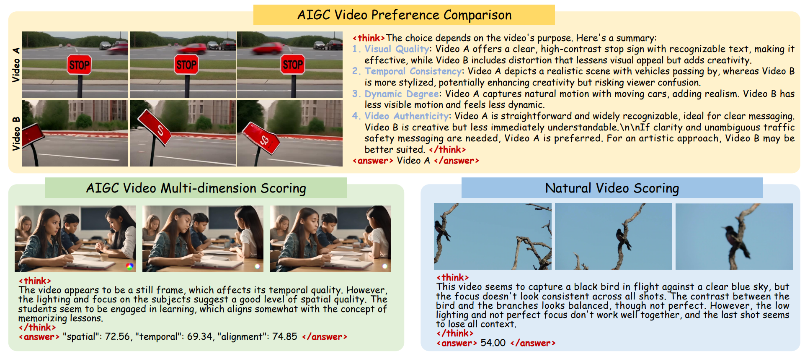

<div align="center">
<h2>

VQ-Insight: Teaching VLMs for AI-Generated Video Quality Understanding via Progressive Visual Reinforcement Learning

</h2>

[Xuanyu Zhang*](https://scholar.google.com/citations?user=Sq2q-E8AAAAJ&hl=zh-CN&oi=ao), [Weiqi Li*](https://scholar.google.com/citations?user=SIkQdEsAAAAJ), Shijie Zhao, Junlin Li, Li Zhang, Jian Zhang

  <a href="https://arxiv.org/abs/2506.18564">
    
  </a>

<a href="https://huggingface.co/ByteDance/Q-Insight">
    
</a>

</div>

## 🔥 Introduction
We propose a reasoning-style vision-language model VQ-Insight, which accurately performs AIGC video preference comparison, AIGC video multi-dimension scoring, and natural video scoring, accompanied by detailed and reasonable reasoning processes. Our VQ-Insight can be applied to post-training of video generation models and zero-shot content repairing.

<p align="center">
  
</p>


## 🔧 Dependencies and Installation
```bash
git clone https://github.com/xuanyuzhang21/VQ-Insight
bash setup.sh
```

## ⚡ Quick Inference

#### Natural Video Scoring
```bash
cd demo
python demo_vqinsight_score.py \
  --video_path "../assets/demo_natural.mp4" \
  --video_type natural
```

#### AIGC Video Multi-Dimension Scoring
```bash
cd demo
python demo_vqinsight_score.py \
  --video_path "../assets/demo_aigc.mp4" \
  --video_type aigc
```

#### AIGC Video Comparison
```bash
cd demo
python demo_vqinsight_comp.py \
  --video_a "../assets/demo_comp1.mp4" \
  --video_b "../assets/demo_comp2.mp4" \
  --model_name_or_path Bytedance/Q-Insight

```

## Training

### AIGC Video Comparison
Download the [VisionReward](https://huggingface.co/datasets/zai-org/VisionRewardDB-Video) dataset and run the script. The training json is put in ```./data```.

```bash
bash ./src/scripts/run_grpo_video_comp.sh
```

### AIGC Video Multi-dimension Scoring
Download the [LGVQ](https://github.com/zczhang-sjtu/UGVQ) dataset and run the script. The training json is put in ```./data```.

```bash
bash ./src/scripts/run_grpo_video_lgvq_aigc.sh
```

### Natural Video Scoring
Download the [LSVQ](https://huggingface.co/datasets/teowu/LSVQ-videos) dataset and run the script. The training json is put in ```./data```.

```
bash ./src/scripts/run_grpo_video_lsvq.sh
```


## Acknowledgement
We appreciate the releasing codes of [Video-R1](https://github.com/tulerfeng/Video-R1).


## Citation
If you find the code helpful in your research or work, please cite the following papers and ⭐ the repo:
```
@article{zhang2025vqinsight,
  title={VQ-Insight: Teaching VLMs for AI-Generated Video Quality Understanding via Progressive Visual Reinforcement Learning},
  author={Zhang, Xuanyu and Li, Weiqi and Zhao, Shijie and Li, Junlin and Zhang, Li and Zhang, Jian},
  journal={Proceedings of the AAAI Conference on Artificial Intelligence (AAAI)},
  year={2026}
}
```
